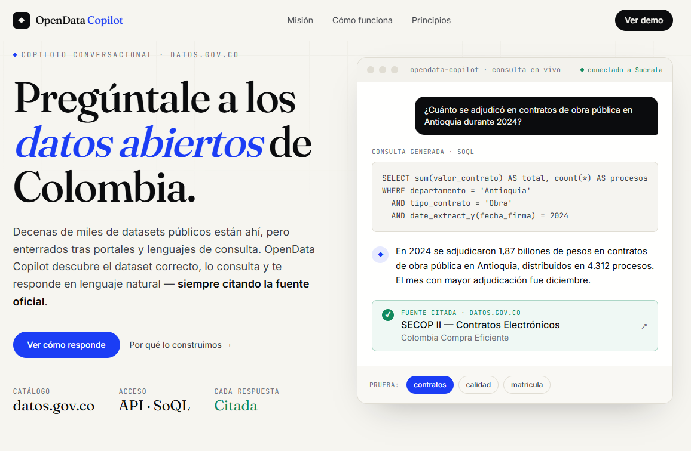

# 🚀 OpenData Copilot

## Conversa con los datos abiertos de Colombia

¿Qué pasaría si cualquier ciudadano pudiera hacer preguntas sobre información pública de la misma forma en que conversa con un asistente de IA?

**OpenData Copilot** transforma miles de conjuntos de datos publicados en datos.gov.co en respuestas claras, útiles y fáciles de entender.

Ya no es necesario buscar archivos, descargar hojas de cálculo o interpretar estructuras complejas. Solo pregunta.

--------------------------

## 💡 El problema

Colombia cuenta con miles de conjuntos de datos abiertos que contienen información valiosa sobre salud, educación, seguridad, economía, medio ambiente y muchos otros temas.

Sin embargo, para la mayoría de los ciudadanos estos datos siguen siendo difíciles de encontrar, comprender y utilizar.

---

## ✅ Nuestra solución

OpenData Copilot actúa como un puente entre los ciudadanos y los datos abiertos.

La plataforma:

* Descubre e indexa automáticamente los conjuntos de datos publicados.
* Comprende preguntas en lenguaje natural.
* Identifica las fuentes más relevantes.
* Analiza la información disponible.
* Genera respuestas claras y fáciles de interpretar.
* Muestra la fuente de los datos para garantizar transparencia.

---

## 🗣️ Ejemplos de preguntas

* ¿Cuáles son los municipios con mayor índice de desempleo?
* ¿Cómo ha evolucionado la accidentalidad vial en los últimos años?
* ¿Qué departamentos tienen mayor cobertura de internet?
* ¿Cuántas instituciones educativas existen en mi ciudad?
* ¿Cómo se distribuye el presupuesto público en determinada región?

---

## 🌎 Impacto esperado

Queremos que los datos abiertos dejen de ser archivos difíciles de interpretar y se conviertan en información accesible para todos.

Con OpenData Copilot buscamos:

* Fortalecer la transparencia.
* Promover decisiones informadas.
* Facilitar la investigación y el periodismo de datos.
* Acercar el gobierno abierto a la ciudadanía.
* Democratizar el acceso a la información pública.

---

## 🎯 Nuestra visión

Imaginamos un país donde cualquier persona pueda acceder al conocimiento contenido en los datos públicos simplemente haciendo una pregunta.

**Porque los datos abiertos solo generan valor cuando las personas pueden entenderlos y utilizarlos.**
