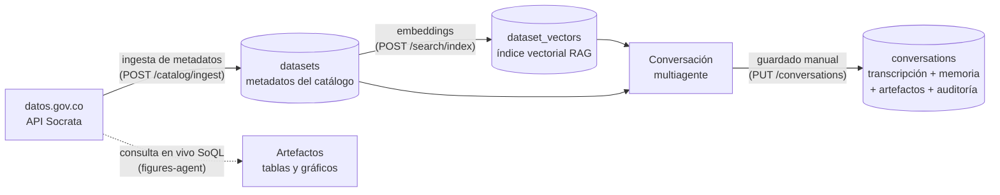

# data/ — Estructuras de datos del sistema

En la guía del concurso, `data/` contiene copias de los datos (raw/processed/realtime). En este
proyecto los datos **no se copian al repositorio**: se consultan **en vivo** sobre la API oficial
de datos.gov.co ([ADR-0002](../docs/adr/0002-socrata-sin-scraping.md)) y sólo se persisten
metadatos, vectores y conversaciones ([ADR-0005](../docs/adr/0005-estrategia-datos-hibrida.md)).
Esta carpeta documenta **las estructuras de esos almacenes**, campo a campo, leídas del código
real.

## Ciclo de vida del dato

- **Los datos de los datasets nunca se replican**: el agente de cifras genera SoQL, lo ejecuta
  sobre la fuente oficial y tabula el resultado; sólo ese resultado (el artefacto de una
  respuesta) queda en la conversación.
- Todos los almacenes están detrás de puertos con adaptadores intercambiables por configuración
  ([ADR-0003](../docs/adr/0003-ports-adapters-intercambiables.md)): `InMemory` en desarrollo
  (costo $0) y MongoDB Atlas en producción.

## Almacenes documentados

| Documento | Colección (Atlas, BD `odc_BD`) | Contenido |
|---|---|---|
| [`catalogo_datasets.md`](catalogo_datasets.md) | `datasets` | Metadatos del catálogo (agregado `Dataset`) |
| [`rag_embeddings.md`](rag_embeddings.md) | `dataset_vectors` | Estructura RAG: embeddings + índice Atlas Vector Search |
| [`conversaciones.md`](conversaciones.md) | `conversations` | Conversaciones: transcripción, memoria, artefactos y auditoría |

Los nombres de base de datos y colecciones se configuran en
`src/JYDE.OpenDataCopilot.Api/appsettings.json → Mongo` (valores por defecto en
`MongoOptions`).

> Resumen ejecutivo del modelo: [`docs/data_dictionary.md`](../docs/data_dictionary.md).
