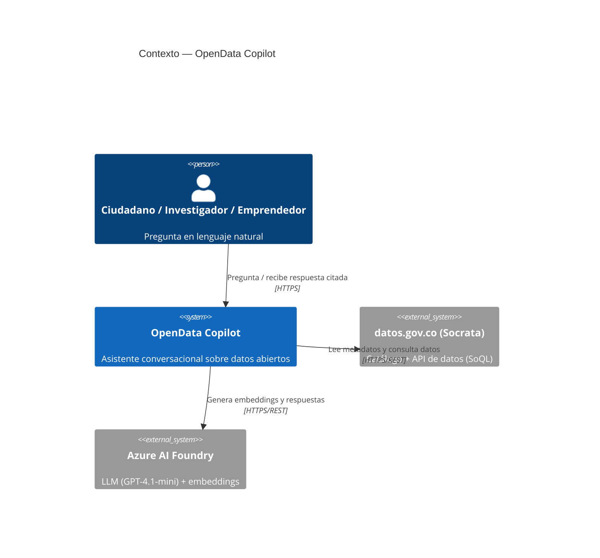
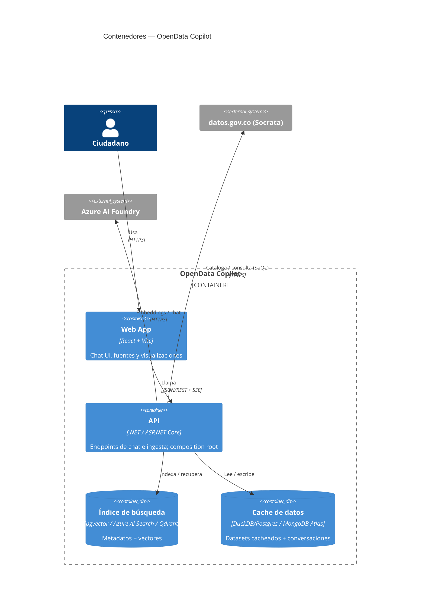
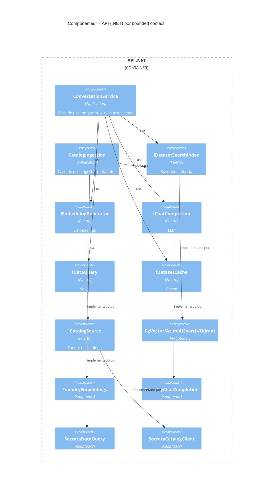
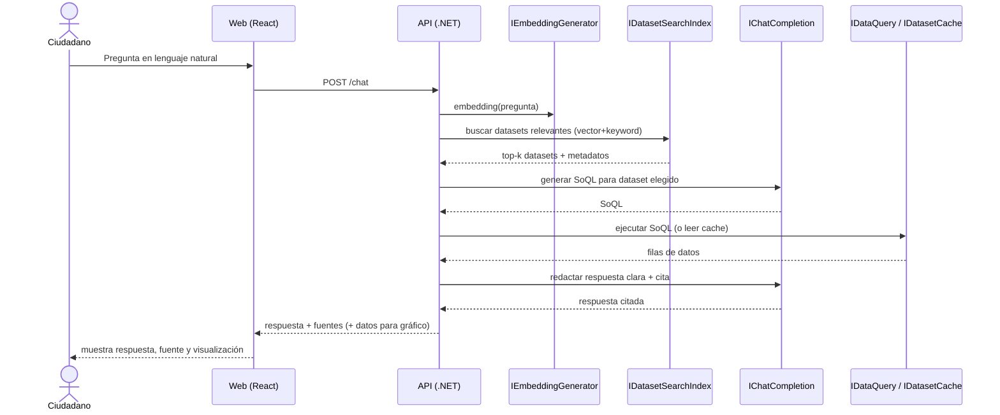

# Software Architecture Document (SAD) — OpenData Copilot

> **Estado:** vivo · **Versión:** 1.0 · **Última actualización:** 2026-06-18
> **Fuente única de verdad** de la arquitectura. Tanto `CLAUDE.md` (Claude Code) como
> `.github/copilot-instructions.md` (GitHub Copilot) derivan sus reglas de este documento y de
> los [ADRs](../adr/). Si una regla cambia, se actualiza **aquí** y se referencia, no se duplica.

---

## 1. Visión y contexto

**OpenData Copilot** es un asistente conversacional que democratiza el acceso a los datos abiertos del Estado colombiano (`datos.gov.co`, 8.000+ datasets). El ciudadano pregunta en lenguaje natural y el sistema descubre los datasets relevantes, consulta los datos y responde de forma clara **citando siempre la fuente**.

- **Concurso:** Datos al Ecosistema 2026 (MinTIC).
- **Valores del concurso:** uso responsable/ético de la IA, impacto social, escalabilidad.

---

## 2. Drivers y atributos de calidad

| Atributo | Objetivo | Cómo se logra |
|----------|----------|---------------|
| **Bajo costo** | Cercano a $0 en desarrollo | Adaptadores locales (Docker), modelos baratos (GPT-4.1-mini), capas free en prod |
| **Intercambiabilidad** | Cambiar proveedor sin tocar el dominio | Ports & adapters + selección por configuración |
| **Confiabilidad de la respuesta** | No alucinar; trazabilidad | RAG sobre metadatos + cita obligatoria de la fuente + guardrails |
| **Time-to-market** | Demo funcional en 3 semanas | Socrata API (sin scraping), vertical slices, skills que automatizan el patrón |
| **Escalabilidad** | De demo a nivel nacional | Backend stateless + servicios gestionados de Azure |
| **Mantenibilidad** | Equipo + 2 asistentes de IA | Hexagonal/DDD, límites de capa estrictos, TDD por convención, gobierno documentado |

---

## 3. Decisiones de arquitectura (resumen — detalle en ADRs)

| ADR | Decisión |
|-----|----------|
| [0001](../adr/0001-stack-dotnet-hexagonal-ddd.md) | Stack .NET con arquitectura hexagonal + DDD; frontend React |
| [0002](../adr/0002-socrata-sin-scraping.md) | Ingesta vía API de Socrata (catálogo + SoQL); **sin** web scraping |
| [0003](../adr/0003-ports-adapters-intercambiables.md) | Cada dependencia externa = puerto con adaptadores intercambiables por config |
| [0004](../adr/0004-azure-foundry-gpt41mini.md) | Modelos vía Azure AI Foundry; GPT-4.1-mini inicial por costo |
| [0005](../adr/0005-estrategia-datos-hibrida.md) | Datos híbridos: metadatos amplios + cache selectivo |
| [0006](../adr/0006-tdd-por-convencion.md) | TDD por convención (sin hooks de enforcement) |
| [0007](../adr/0007-estandar-clean-code-solid.md) | Estándar de codificación: Clean Code, SOLID, un tipo por archivo |
| [0008](../adr/0008-stack-frontend-vite-zustand.md) | Frontend: base con Vite y Zustand (y gobierno de librerías) |
| [0009](../adr/0009-estilos-tailwind.md) | Estilos/UI del frontend: Tailwind CSS |
| [0010](../adr/0010-api-con-controladores.md) | API con controladores MVC (no Minimal API) |
| [0011](../adr/0011-api-no-referencia-dominio.md) | La API no referencia el Domain; consume DTOs de Application |
| [0012](../adr/0012-persistencia-mongodb-atlas.md) | Persistencia con MongoDB Atlas (driver y almacén del catálogo) |
| [0013](../adr/0013-embeddings-foundry-y-local-dev.md) | Embeddings: Foundry (objetivo) + adaptador local para dev |

> Prácticas de código (Clean Code, SOLID, convenciones): ver
> [`coding-standards.md`](coding-standards.md).

---

## 4. Estilo arquitectónico: Hexagonal + DDD

Arquitectura de **puertos y adaptadores**. El **dominio** y la **aplicación** no conocen detalles de infraestructura; dependen de **interfaces (puertos)** que la **infraestructura** implementa (adaptadores). La **API** es el *composition root* que cablea todo por configuración.

**Regla de dependencias (sólo hacia adentro):**

```
Api ──► Infrastructure ──► Application ──► Domain
            │                                 ▲
            └─────────────────────────────────┘  (Infrastructure → Domain, transitivo)
```

> El flujo va **siempre hacia adentro**: Application define los puertos y depende de Domain;
> Infrastructure implementa esos puertos y usa Domain de forma transitiva; Api compone todo.

- **Domain**: entidades, value objects, agregados, reglas de negocio puras. **Cero** dependencias externas.
- **Application**: casos de uso, orquestación, **define los puertos** (interfaces) y DTOs.
- **Infrastructure**: **adaptadores** que implementan los puertos (Socrata, Foundry, índices, cache).
- **Api**: ASP.NET Core con **controladores MVC** (no Minimal API, ver
  [ADR-0010](../adr/0010-api-con-controladores.md)), DI/composición, configuración.

### Lenguaje ubicuo (glosario mínimo)
- **Dataset**: conjunto de datos publicado en `datos.gov.co` (con metadatos y datos consultables).
- **Catálogo**: colección indexable de metadatos de datasets.
- **Metadato**: descripción del dataset (nombre, descripción, columnas, categoría, tags, fuente).
- **Consulta (Query)**: pregunta del usuario en lenguaje natural.
- **SoQL**: Socrata Query Language; el "SQL" de la API de Socrata.
- **Recuperación (Retrieval)**: selección de datasets relevantes para una consulta (búsqueda híbrida).
- **Respuesta citada**: respuesta en lenguaje natural acompañada de la fuente (dataset + enlace).
- **Cache selectivo**: copia local de los datasets más usados para consulta rápida/offline.

---

## 5. Bounded Contexts

| Contexto | Responsabilidad | Puertos principales | Adaptadores |
|----------|-----------------|---------------------|-------------|
| **Catalog** | Ingestar/almacenar metadatos del catálogo | `ICatalogSource`, `ICatalogRepository` | `SocrataCatalogClient`; `InMemory`/`Mongo` (repositorio) |
| **Search** | Indexar y recuperar datasets (vector + keyword) | `IDatasetSearchIndex`, `IEmbeddingGenerator` | `PgVector`/`AzureAISearch`/`Qdrant`, `FoundryEmbeddings` |
| **Conversation** | Orquestar pregunta → respuesta citada | `IChatCompletion`, `IDataQuery`, `IConversationStore` | `FoundryChatCompletion`, `SocrataDataQuery` |
| **DataCache** | Cachear datasets seleccionados | `IDatasetCache` | `DuckDb`/`Postgres` (local), `MongoAtlas` (prod) |

---

## 6. Diagramas C4

### Nivel 1 — Contexto del sistema



### Nivel 2 — Contenedores



### Nivel 3 — Componentes de la API (puertos y adaptadores)



---

## 7. Flujo de una consulta (runtime)



---

## 8. Selección de adaptadores por configuración

```jsonc
// appsettings.json (Api). Local por defecto = gratis; producción se sobreescribe por entorno.
{
  "Providers": {
    "SearchIndex": "PgVector",   // PgVector | AzureAISearch | Qdrant
    "DatasetCache": "DuckDb",    // DuckDb | Postgres | MongoAtlas
    "Chat": "Foundry",
    "Embeddings": "Foundry"
  }
}
```

El *composition root* (`Program.cs`) registra el adaptador según el valor de configuración. Añadir
un proveedor nuevo = nuevo adaptador + una rama de registro, **sin tocar dominio ni aplicación**.

---

## 9. Estrategia de datos (híbrida)

- **Amplitud (descubrimiento):** indexar metadatos del catálogo (todo o filtrado por las 5 áreas).
  Barato: sólo metadatos + embeddings.
- **Profundidad (respuestas con datos):** consulta on-demand vía SoQL + **cache selectivo** de
  los datasets más usados para velocidad y demo offline.
- **Honestidad:** si no hay soporte en los datos, el sistema lo dice; nunca inventa cifras.

---

## 10. Riesgos y mitigaciones

| Riesgo | Mitigación |
|--------|-----------|
| Esquemas heterogéneos → SoQL inválido | Validar SoQL, manejar error, set curado para profundidad |
| Costo de embeddings sobre 8.000 datasets | Empezar filtrado por áreas; modelo de embeddings barato; cache de embeddings |
| Latencia del LLM | Caching, prompts cortos, streaming (SSE) |
| Cambios/caída de la API de Socrata | Reintentos, timeouts, datos cacheados |
| Alucinaciones | RAG + cita obligatoria + guardrails de "no sé" |

---

## 11. Arquitectura del Frontend (React + Vite)

SPA que consume la API REST (ver [ADR-0001](../adr/0001-stack-dotnet-hexagonal-ddd.md)). Aplica los mismos valores de calidad que el backend: tipado fuerte, separación de responsabilidades, código
testeable y consistente. El estándar de [`coding-standards.md`](coding-standards.md) (nombres, funciones pequeñas, un componente por archivo, DRY/KISS/YAGNI) aplica también aquí.

### Stack (ver [ADR-0008](../adr/0008-stack-frontend-vite-zustand.md))

**Decidido:**
- **React + TypeScript** (`strict`) — garantías de tipos análogas a las del backend.
- **Vite** — herramienta de build y servidor de desarrollo.
- **Zustand** — manejo de estado de la aplicación (ligero, tipado, desacoplado).
- **Tailwind CSS** — sistema de estilos con *design tokens* e integración Vite ([ADR-0009](../adr/0009-estilos-tailwind.md)); los componentes propios viven en `shared/ui`.
- **Streaming:** consumo de **SSE** para mostrar la respuesta del chat token a token (es parte del
  contrato con el backend, no una librería).

**Pendiente por concertar** (se decidirá y registrará en SAD + ADR al abordarse): obtención y cache de datos del servidor, gráficos/visualización, framework de pruebas, i18n, y (si se requiere) una librería de primitivas accesibles sobre Tailwind.

> **Gobierno de librerías:** toda nueva dependencia (frontend o backend) se **concierta con el
> equipo** y se registra **actualizando este SAD y un ADR** antes de adoptarse. No se introducen
> librerías de facto.

### Organización (feature-based, separación de responsabilidades)
```
web/
├── src/
│   ├── app/            # bootstrap, providers, routing
│   ├── features/       # por dominio de UI
│   │   ├── chat/       # componentes, hooks y modelo de la conversación
│   │   └── datasets/   # exploración/visualización de datasets y fuentes
│   ├── shared/
│   │   ├── api/        # cliente HTTP tipado + tipos del contrato de la API
│   │   ├── ui/         # componentes reutilizables (design system)
│   │   └── lib/        # utilidades
│   └── styles/
└── ...
```

- **Capa `shared/api`** = frontera con el backend: un cliente tipado que aísla `fetch`/SSE y mapea errores; los componentes nunca llaman a la red directamente (analogía a los puertos del backend).
- Componentes de presentación desacoplados de la obtención de datos (hooks de datos; la librería de data-fetching/cache está pendiente de concertar). Un componente/módulo por archivo.

### Calidad y pruebas
- **TypeScript `strict`** (decidido). Linter/formatter y framework de pruebas: **pendientes por concertar** (candidatos: ESLint + Prettier, Vitest + React Testing Library), a registrar en SAD+ADR.
- Pruebas centradas en la conducta del usuario; un componente/módulo por archivo.
- **Accesibilidad** (roles/ARIA, navegación por teclado) y diseño responsivo como requisitos.

### Contrato Frontend ↔ Backend
- Comunicación JSON/REST + **SSE** para el chat. Los tipos del cliente reflejan los DTOs de la API.
- Toda respuesta del chat muestra **la fuente citada** (dataset + enlace), reflejando el guardrail del backend.

---

## 12. Despliegue (objetivo)

- **Desarrollo:** todo local — `docker compose up` (Postgres/pgvector, Qdrant) + `dotnet run` + Vite.
- **Producción:** Azure Container Apps / App Service (API), Azure Static Web Apps (web),
  Azure AI Search + MongoDB Atlas (free tier), Azure AI Foundry (modelos).
