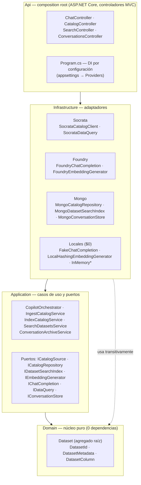
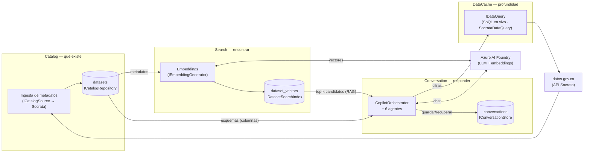
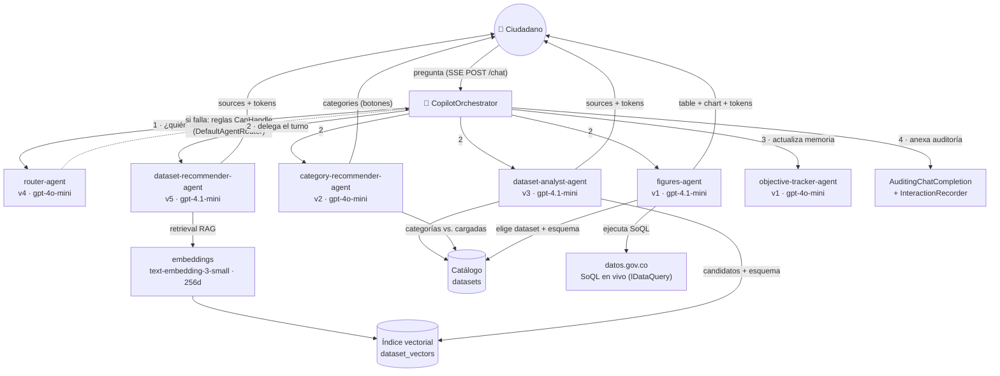
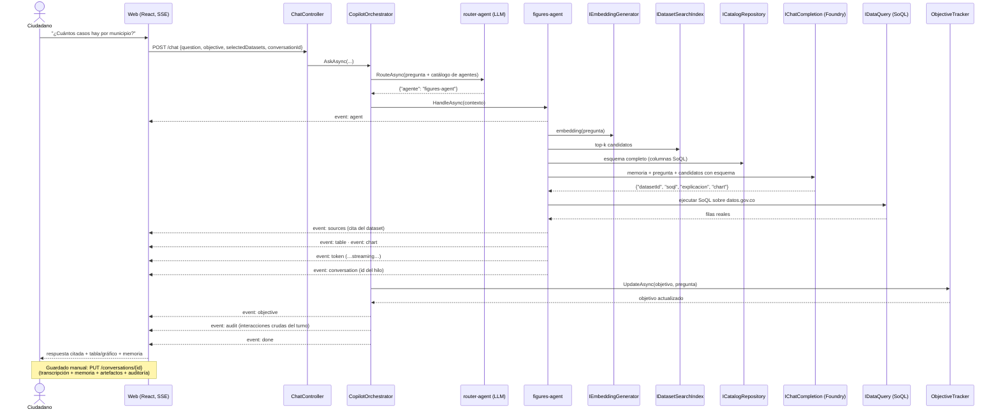
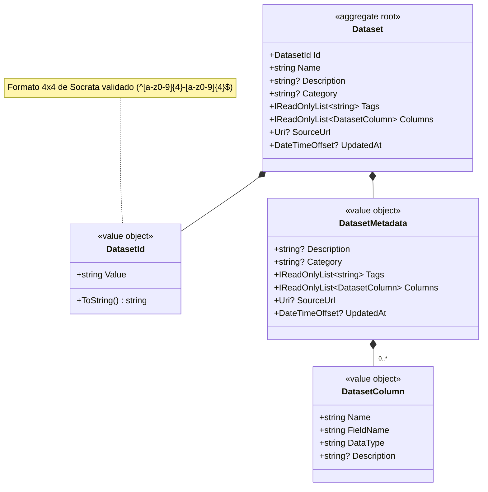
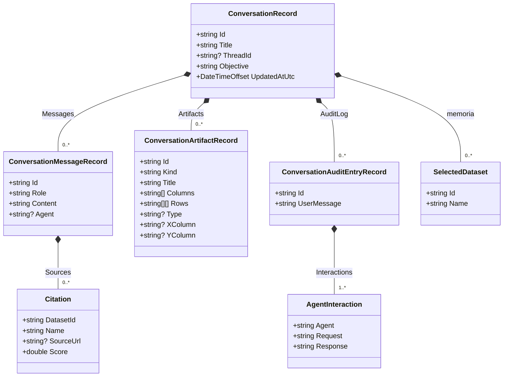
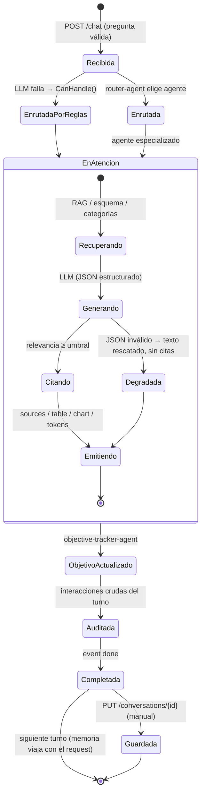
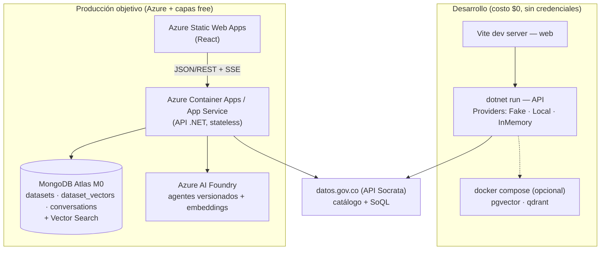

# Diagramas de arquitectura (Mermaid)

Complemento visual del [SAD](SAD.md) (que contiene los diagramas C4 niveles 1–3). Todos los
diagramas reflejan el **código real** del repositorio; los nombres de clases, puertos y agentes
son los del código.

Índice:
1. [Arquitectura DDD: capas hexagonales](#1-arquitectura-ddd-capas-hexagonales)
2. [Mapa de bounded contexts (context map)](#2-mapa-de-bounded-contexts-context-map)
3. [Integración entre agentes](#3-integración-entre-agentes)
4. [Secuencia de una conversación](#4-secuencia-de-una-conversación)
5. [Clases del dominio y del modelo de conversación](#5-clases-del-dominio-y-del-modelo-de-conversación)
6. [Estados de un turno de conversación](#6-estados-de-un-turno-de-conversación)
7. [Despliegue](#7-despliegue)

---

## 1. Arquitectura DDD: capas hexagonales

Regla de dependencias **sólo hacia adentro** (ver [SAD §4](SAD.md#4-estilo-arquitectónico-hexagonal--ddd)):
Application define los puertos, Infrastructure los implementa, Api compone por configuración.

## 2. Mapa de bounded contexts (context map)

Los 4 contextos del [SAD §5](SAD.md#5-bounded-contexts) y cómo se relacionan:

## 3. Integración entre agentes

Los 6 agentes reales ([`models/`](../../models/README.md)) y su colaboración en un turno
([ADR-0015](../adr/0015-arquitectura-multiagente.md)):

- **gpt-4o-mini** (clasificar/resumir: router, objetivo, categorías) y **gpt-4.1-mini**
  (razonar: recomendar, analizar, SoQL) — modelos de bajo costo por diseño
  ([ADR-0004](../adr/0004-azure-foundry-gpt41mini.md)).
- Todos los agentes reciben la memoria (`ContextHeader`: objetivo + datasets fijados) y sólo
  citan lo que supera el umbral de relevancia re-calculada (0.5).

## 4. Secuencia de una conversación

Turno completo, de la pregunta a la respuesta citada con auditoría y memoria
(ejemplo con el agente de cifras; eventos SSE en negrita):

## 5. Clases del dominio y del modelo de conversación

Dominio del contexto Catalog (código real de `src/JYDE.OpenDataCopilot.Domain/Catalog/`):

Modelo de conversación persistida (DTOs de Application,
[ADR-0017](../adr/0017-persistencia-conversaciones.md)):

## 6. Estados de un turno de conversación

Máquina de estados de un turno en `CopilotOrchestrator` (con las degradaciones explícitas —
guardrails de resiliencia):

## 7. Despliegue

Según [SAD §12](SAD.md#12-despliegue-objetivo): desarrollo 100 % local y gratuito; producción en
servicios gestionados con capas free.

